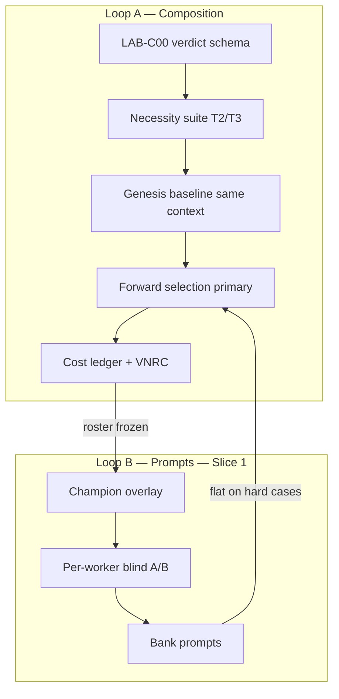

# Team Lab — Composition, Seat Economics, and Named Teams

Status: **Active implementation spec** — mentor review incorporated; ready for LAB-C00+
Owner: Founder + Team Quality + CLI/MCP
Updated: 2026-06-23
Depends on: [`Team_Lab_Run_Factory.md`](Team_Lab_Run_Factory.md),
[`Team_Lab_Slice_1_Full_Package.md`](Team_Lab_Slice_1_Full_Package.md),
[`Team_And_Skill_Catalogs.md`](Team_And_Skill_Catalogs.md)
Supersedes nothing — extends Slice 1 after Bug Hunt R7/R8 calibration evidence

## Founder Intent

Slice 1 proved the **micro loop**: on a **fixed roster**, blind per-worker A/B can
bank better prompts when the run substrate is truthful. That is necessary but not
sufficient.

The next question is whether the **team itself** is right:

```text
Every default Team earns its seat.
```

"Earns its seat" is **economics**, not aesthetics. A seat must clear a **margin**:

```text
marginal_benefit > marginal_cost
```

on the cases that team exists for — not merely "does not actively hurt the
deliverable."

Two loops, one promise:

| Loop | Question | Unit of change |
| --- | --- | --- |
| **Macro (composition)** | Is the roster right for this named team? | Add / remove / merge seats; pick variant; writer contract |
| **Micro (prompts)** — Slice 1 built | Given this roster, are prompts good? | Per-role hypothesis patches |

**Rules (bind all harness work):**

- Micro promotion cannot substitute for macro evidence.
- Macro promotion cannot use easy-suite ablation alone.
- Removing a shipping seat is **harder to reverse** than banking a prompt — removal
  needs a **strictly higher** evidence bar than addition.

## Product Value

Users pick a **named Team** (`Bug Hunt Lite`, `Bug Hunt`, `Bug Hunt Forensics`), not
a hidden worker tax. Allnighter should learn:

- which lineup fits which bug class;
- which seats earn their margin on hard cases;
- when synthesis drops specialist signal (writer contract bug, not "useless worker");
- when the first team was too small and escalation is warranted.

Without macro loop, prompt banking on a bloated roster optimizes theater: more
paragraphs, same deliverable, rising latency, timeouts, and quota burn.

## Seat Economics (definition)

A worker **W** on named team **T** has **positive seat economics** on case class **C**
when all of the following hold on the **necessity suite** for **C**:

### Marginal benefit (quality)

Measured on **fresh inputs** with **held context** (same evidence packet across arms):

| Signal | Meaning |
| --- | --- |
| **Deliverable delta** | Two-judge blind A/B on final packet favors roster **with** W vs without |
| **VNRC** | Verified non-redundant contribution (see below) — not raw uniqueness |
| **Genesis lift** | A case where genesis baseline **failed** becomes **solvable** when W is added (forward selection) |
| **Bad-fix prevention** | W reliably blocks or flags weak-tier fixes on T3 seam cases (judge-audited) |

**Corroboration is signal, not waste.** Two workers independently pinning the same
`file:line` increases confidence; it does **not** by itself nominate removal.

### Marginal cost (ledger)

Every macro arm records a **cost ledger** from lab artifacts (`experiment.json`,
`team-status-history.json`, preflight):

| Cost | Source |
| --- | --- |
| **Wall-clock** | `run.durationMs` |
| **Failure surface** | Worker timeouts, partial runs, `runContractScore < 0.95`, `fsBypass` |
| **Quota / model spend** | Worker count × model tier (proxy until billing lands) |
| **Synthesis noise** | Writer input token volume; judge-flagged contradiction density |

A seat that adds a small deliverable edge but **materially** raises timeout rate or
doubles wall-clock on T3 cases does **not** earn a **default** seat. It may still
earn a **Forensics-only** seat (see named variants).

### Margin verdict

```text
seat_margin = marginal_benefit − marginal_cost

KEEP     — margin > 0 on necessity suite (or tie + neutral/negative cost)
ADD      — forward selection: margin > 0 on hard cases OR genesis lift
REMOVE   — margin ≤ 0 across ≥ N fresh necessity inputs AND no VNRC lost
MERGE    — two seats: redundant VNRC, deliverable unchanged, cost reduced
ESCALATE — variant too small for case class (Lite → Bug Hunt → Forensics)
HOLD     — insufficient evidence; do not mutate roster
```

**Tie on deliverable:** tie alone does **not** justify **ADD**. Tie + meaningful
marginal cost → **do not keep** for default roster. Tie + negative cost → **REMOVE**
candidate.

## Problem Statement (what Slice 1 got wrong)

### Fixed-roster prompt optimization

Today's harness treats composition as settled (`controlled=True`, 1:1 role mapping).
Structural changes break per-worker compare and fall back to deliverable-only — so
they are avoided. Result: **instructions on a frozen org chart.**

### The easy-bug trap

On shallow bugs, almost any model produces a plausible packet. Ablation always says
"shrink the team." That is true for **T1** and false as product policy. Easy cases
are **harness calibration only** — never evidentiary for **REMOVE**.

### Keyword theater → uniqueness theater

Slice 1 removed deterministic keyword scoring (Goodhart). Macro must not replace it
with **unique-fact counting** where novel nonsense scores as "justified."

**VNRC (verified non-redundant contribution)** — a claim counts only if:

1. **Verified** — source-cited (`file:line`, artifact ref) or judge-validated on
   audit prompt;
2. **Relevant** — pertains to truth owner, seam, fix level, or proof plan for this case;
3. **Non-redundant** — not already present from another worker's VNRC set;
4. **Disposition known** — carried into writer packet **or** explicitly logged as
   `dropped_by_writer` with reason.

Raw embedding/Jaccard similarity is a **pre-filter only**. Any **REMOVE** decision
that rests on redundancy requires **judge confirmation** on borderline claims.

### Worker value ≠ writer carry-through

Three distinct outcomes (macro record must distinguish):

| Outcome | Meaning | Action |
| --- | --- | --- |
| `no_value` | W adds no VNRC; deliverable unchanged when W removed | REMOVE candidate |
| `value_suppressed` | W has VNRC; deliverable unchanged when W removed | Fix **writer/synthesis** contract; do not REMOVE W on this evidence alone |
| `noise_correctly_dropped` | W adds junk; writer ignored it; deliverable unchanged | REMOVE or merge W |

Slice 1 deliverable A/B is **audit-only** for micro (interaction warning, never
vetoes per-worker banks). Macro **intentionally inverts** that stance: structural
changes break 1:1 role mapping, so **deliverable A/B is the primary decider** for
composition, supplemented by VNRC + cost ledger — not per-worker blind compare.

### Genesis must control context

Genesis baseline failure proves a case has **teeth**, not that specialists fix it.

**Hold constant across genesis and full roster:**

- Same `case.prompt` and `contextPolicy` / evidence packet;
- Same model policy pool (no "full roster gets richer context");
- Only **seat count / roster** varies.

Otherwise macro "wins" measure context inflation, not seat necessity.

### Greedy selection and interaction

Forward/backward one-seat-at-a-time selection is **blind to interaction**. Example:
`contrarian_root_cause` may only pay off after `state_skeptic` surfaces the
contradiction it attacks — testing Contrarian alone will never justify it.

**Mitigation (v1):**

- Document greedy selection as a **known limitation**.
- Run **joint pair probes** on hypothesized interacting seats (e.g. Skeptic +
  Contrarian) before declaring interaction-heavy seats failed.
- Prefer **forward selection** (discover value) over backward elimination (assume
  bloat).

### Quick-win / fix-level gap (hypothesis, not shipped seat)

Several Bug Hunt prompts already mention zoom-out and smallest *correct* fix. The
writer still converges on nearest patches. The gap may be:

- a new seat;
- a writer-contract field (`warrantedFixLevel`);
- a prompt patch on `change_impact_reviewer` or `correct_fix_planner`.

**This packet does not ship a Fix Level Auditor.** It registers **fix-level
discipline** as the macro loop's first **composition hypothesis** (LAB-C06). The loop
adjudicates mechanism; the doc does not pre-pick the winner.

**Principle if a fix-level seat exists:** *smallest **warranted** fix, not deepest
impressive fix* — reject weak-tier patches without evidence, but do not push
structural change when a line-pinned local fix is justified.

## Proposed Lab Architecture



**Macro question (default):**

```text
What is the smallest team that reliably solves this case class?
```

**Backward ablation** (`roster − W`) is for **redundancy detection** and merge
candidates after forward selection stabilizes — not the primary discovery mode.

## Case Metadata (suite schema)

**Primary truth — capabilities, not workers:**

```json
{
  "caseId": "composer_paste_dead_v1",
  "tier": "T3",
  "requiredCapabilities": [
    "seam_trace",
    "adversarial_theory",
    "isolation_harness",
    "fix_level_discipline"
  ],
  "provenance": "debugger_packet",
  "genesisRequired": true
}
```

| Field | Role |
| --- | --- |
| `tier` | T1 / T2 / T3 — aligns with `docs/operations/Debugger.md` |
| `requiredCapabilities` | What a complete packet must demonstrate; **case truth** |
| `provenance` | `committed` \| `generated` \| `debugger_packet` \| `lab_failure` |
| `genesisRequired` | Must record genesis failure before macro REMOVE claims |

**Evaluator metadata (not case truth):**

```json
{
  "capabilityWorkerPredictions": {
    "seam_trace": ["trace_mapper#0"],
    "adversarial_theory": ["contrarian_root_cause#0"]
  }
}
```

Predictions are **scored after ablation** (did removing predicted worker drop
capability coverage?) — they do **not** filter which cases count. Filtering on
pre-tagged "load-bearing" workers is **banned** (confirmation bias).

### Two suites

| Suite | Contents | Use |
| --- | --- | --- |
| `bug_hunt_repo_regressions_v1` (existing) | Mixed difficulty; fresh inputs per micro round | **Micro** prompt tuning |
| `bug_hunt_necessity_v1` (new) | T2/T3 only; ≥50% `provenance: debugger_packet` or `lab_failure` | **Macro** only |

No **REMOVE** from prompt-tuning suite evidence.

**Necessity suite seed sources (priority order):**

1. Debugger packets where Allnighter / lab / workers actually failed
2. Recorded genesis failures on generated hard cases
3. Generated cases **only** after genesis failure is on file

## Named Team Variants

> **Naming superseded (2026-07-16):** depth-tier names in this section follow
> the old Lite/Forensics vocabulary. The decided convention is
> **Min / (bare name) / Max** — see [`Team_Depth_Naming.md`](Team_Depth_Naming.md).
> Under it, today's Lite roster becomes the bare default "Bug Hunt"
> (`code_bug_hunt`) and Forensics becomes "Bug Hunt Max" (`code_bug_hunt_max`).
> Rosters, seat economics, and routing mechanics below are unchanged.

**Team shape is a named Team, not a generic depth dial** (`Team_And_Skill_Catalogs.md`,
`Language_Cutover.md`). `ALLNIGHTER_TEAM_DEPTH` / effort gating of worker rows is
**legacy machinery** — forward product expresses shape as **distinct team IDs**,
not Low/Med/High toggles.

| Team ID (lab) | Seats (v1 target) | Case class |
| --- | --- | --- |
| `code_bug_hunt_lite` | Reproducer, Truth Owner, Fix Planner, Regression Guard | T1 / first pass |
| `code_bug_hunt` | Lite + Trace Mapper, State Skeptic, Change Impact Reviewer | T2 cross-layer |
| `code_bug_hunt_forensics` | Bug Hunt + User Impact, Contrarian Root Cause | T3 repeated / seam / trust |

**Product-facing names** (marketing may differ from lab IDs):

- Bug Hunt Lite
- Bug Hunt
- Bug Hunt Forensics (preferred over "Exterminator" — vivid internal codename OK)

Each variant = **separate champion overlay** under `docs/team-lab/champions/` — not
an amputated copy of the nine-seat High roster.

### Variant selection (product — not fully built)

Users do not know T1/T2/T3 when filing a bug. Classification is Bug Hunt's job.

**v1 routing (spec):**

1. **Default send** → `code_bug_hunt_lite` for new "something's broken" reports.
2. **Packet recommends escalation** when Lite deliverable flags `escalationRecommended:
   hard_seam | repeated_failure | insufficient_proof` (writer field — LAB-C08).
3. **User override** — picker always shows all three named teams.
4. **Auto-Fix failure** (`Try_Fix_Auto_Implement.md`) → suggest Forensics re-run;
   does not silently mutate team without user approval.

**Lab implication:** calibrate each variant on its necessity slice. Wrong routing
moots calibration — LAB-C08 adds routing recommendation eval on mixed-tier suite.

Macro necessity runs **within** the variant under test. Do not ask whether
`trace_mapper` is justified when the correct product choice was Lite.

## Macro Gates (asymmetric)

### ADD seat (forward selection)

Requires **any** of on necessity suite (≥ **3** fresh inputs):

- Deliverable blind A/B favors larger roster (both judges or policy equivalent);
- Genesis-failed case becomes solvable;
- VNRC + judge audit shows bad-fix prevention on T3;
- **And** cost ledger does not show material timeout/contract regression vs incumbent.

**Tie does not ADD** unless cost decreases (strict merge) or risk metric improves
(judge-audited bad-fix prevention).

### REMOVE seat (backward / merge)

Requires **all** of on necessity suite (≥ **5** fresh inputs — **higher bar than ADD**):

- Deliverable non-worse without W (incumbent wins ties);
- No VNRC lost (judge-audited if any borderline);
- Cost improvement meaningful **or** redundancy with another seat confirmed;
- Capability coverage unchanged (required capabilities still demonstrated);
- Run-contract lane not greener **only** because failures were hidden.

Micro banking: ≥3 rounds. Macro **REMOVE**: ≥5 necessity inputs. Macro **ADD**: ≥3.

### MERGE two seats

Deliverable tie; combined VNRC ⊆ union with >70% overlap (pre-filter); judge confirms
redundancy; merged roster **lowers** cost ledger.

## LAB-C00 — Macro Verdict Schema (blocking)

Before C01–C03, define JSON schema and vocabulary in `scripts/team_lab/macro_schema.py`
(+ `docs/team-lab/schemas/macro-verdict-v1.json`):

```json
{
  "schemaVersion": 1,
  "promotionClass": "composition",
  "verdict": "keep | add | remove | merge | escalate | hold",
  "arm": { "baselineRoster": "...", "candidateRoster": "..." },
  "suiteId": "bug_hunt_necessity_v1",
  "caseOutcomes": [],
  "deliverableOutcome": "baseline | candidate | tie",
  "vnrcDelta": { "baselineOnly": [], "candidateOnly": [], "shared": [] },
  "writerDisposition": { "value_suppressed": [], "noise_correctly_dropped": [] },
  "costLedger": {
    "baseline": { "medianDurationMs": 0, "contractFailures": 0, "workerTimeouts": 0 },
    "candidate": { "medianDurationMs": 0, "contractFailures": 0, "workerTimeouts": 0 }
  },
  "seatMargin": "positive | neutral | negative",
  "evidenceValid": true,
  "judgeMode": "live | mock",
  "interactionPairsTested": [],
  "reason": null
}
```

Every later script (`compose.py`, `ablate.py`, `promote.py --macro`) emits this shape.

## Trusted Workflow Slice

```text
LAB-C00 schema landed
-> seed bug_hunt_necessity_v1 (debugger + lab failures, T2/T3)
-> genesis baseline per case (same context, minimal roster, record pass/fail)
-> forward selection round: Lite + candidate seat (same context)
-> deliverable A/B + VNRC extraction + judge audit on borderline
-> cost ledger comparison
-> macro verdict record (add/hold/escalate)
-> optional backward redundancy pass on stabilized roster
-> when roster frozen for variant: micro loop (Slice 1) on prompt-tuning suite
-> periodic genesis re-challenge (not only last champion)
```

## Composition Hypotheses (tracked — not pre-shipped)

| ID | Hypothesis | Macro test |
| --- | --- | --- |
| **H1** | `code_bug_hunt_lite` solves T1 as well as nine-seat roster | Lite vs full on T1 necessity subset |
| **H2** | Trace Mapper earns margin on T2 seam cases | Forward add on `seam_trace` cases |
| **H3** | Fix-level discipline needs new seat vs writer field vs prompt patch | Three structural arms on same T3 cases |
| **H4** | Contrarian + State Skeptic interact | Joint pair probe vs greedy single adds |

## Implementation Slices

| ID | Goal | Proof |
| --- | --- | --- |
| **LAB-C00** | Macro verdict schema + `test_macro_schema.py` | Unit tests; golden fixture JSON |
| **LAB-C01** | Suite schema: `tier`, `requiredCapabilities`, `provenance`, `genesisRequired` | Schema test on 3 committed cases |
| **LAB-C02** | `bug_hunt_necessity_v1` + `.lab/genesis/` records | ≥5 cases; ≥2 debugger_packet; genesis fail on file |
| **LAB-C03** | `compose.py` forward-add one seat; VNRC + cost ledger + writer disposition | Mock judge unit test; one live dogfood |
| **LAB-C04** | `code_bug_hunt_lite.json` overlay (separate team ID) | Necessity suite: Lite vs genesis on T1; contract green |
| **LAB-C05** | Forward selection: Lite → +Trace Mapper on T2 seam cases | Macro verdict `add` with evidenceValid |
| **LAB-C06** | **H3** fix-level discipline — three arms (seat / writer field / prompt patch) | Deliverable + bad-fix judge audit on T3 |
| **LAB-C07** | `promote.py --macro` gate; asymmetric ADD/REMOVE bars | `test_promote.py` composition fixtures |
| **LAB-C08** | Writer `escalationRecommended` field + routing eval | Mixed-tier suite; Lite under-routing flagged |

**Order:** C00 → C01 → C02 → C03 before product overlays (C04+).

**Removed from v1:** backward-only `ablate.py --remove` as flagship proof; redundancy
pass ships after forward baseline exists.

## Works Test

```text
Given bug_hunt_necessity_v1 with tier T2/T3 and requiredCapabilities only (no worker filters)
And genesis baseline failed with the SAME context packet as full roster
When forward selection adds trace_mapper to code_bug_hunt_lite on seam_trace cases
Then macro verdict is add or keep with evidenceValid=true
And cost ledger shows no material contract regression
And VNRC attributes seam pins to trace_mapper with writer disposition logged
When backward REMOVE of trace_mapper is attempted with only 1 necessity input
Then promote.py --macro refuses (insufficient N for REMOVE)
When REMOVE is attempted using only bug_hunt_repo_regressions_v1 T1 cases
Then verdict is hold (non-evidentiary suite)
When worker has VNRC but deliverable unchanged and disposition=value_suppressed
Then verdict is NOT remove (synthesis fix required)
```

### Proof commands

```bash
# C00 — schema
python3 scripts/team_lab/test_macro_schema.py

# C03 — forward selection (primary methodology)
python3 scripts/team_lab/compose.py \
  --suite bug_hunt_necessity_v1 \
  --baseline-overlay docs/team-lab/champions/bug_hunt_repo_regressions_v1/code_bug_hunt_lite.json \
  --add trace_mapper#0 \
  --round 1
# expect: macro-verdict.json verdict=add|hold; costLedger populated; vnrcDelta judged

# C04 — Lite overlay (quality + contract, not contract alone)
python3 scripts/team_lab/run.py --suite bug_hunt_necessity_v1 \
  --champion-overlay docs/team-lab/champions/.../code_bug_hunt_lite.json \
  --round 1 --variant lite-baseline
python3 scripts/team_lab/compose.py ... --compare-genesis
# expect: runContractScore>=0.95 AND deliverable non-worse than genesis on T1 subset
```

## Current State

**Built:** Slice 1 micro loop; Bug Hunt R8 champion; report regeneration on rescore.

**Not built:** LAB-C00–C08; necessity suite; cost ledger; VNRC pipeline; macro promote.

## Truth Owner

| Concern | Owner |
| --- | --- |
| `tier`, `requiredCapabilities`, `provenance` | `docs/team-lab/suites/*.json` |
| `capabilityWorkerPredictions` | Evaluator metadata in macro record (derived) |
| Macro verdict records | `.lab/` + `docs/team-lab/schemas/macro-verdict-v1.json` |
| Named team rosters | `docs/team-lab/champions/<suite>/<team_id>.json` |
| TeamCatalog merge | After transfer guard — same as Slice 1 |

## Lie-prone Layers

- Easy-suite ablation → false REMOVE
- Unique-but-wrong claims → false KEEP
- Corroboration scored as redundancy → false MERGE
- Context mismatch genesis vs full roster → false ADD
- Writer drop scored as no_value → false REMOVE
- `runContractScore` alone → false "Lite is good"
- Pre-tagged load-bearing workers as case filter → confirmation bias
- Greedy selection without pair probes → false REJECT interaction seats
- Tie + positive cost → ratchet bloat

## Non-goals

- No deterministic quality score (unchanged).
- No single-run TeamCatalog mutation.
- No macro REMOVE from prompt-tuning suite.
- No shipping Fix Level Auditor before H3 macro test.
- No Mac app in factory loop.

## Done When

- [x] Mentor review incorporated (2026-06-23).
- [ ] LAB-C00 schema + tests land.
- [ ] Necessity suite ≥5 cases with genesis failures recorded.
- [ ] Forward selection dogfood with `evidenceValid=true` on one ADD or HOLD with reason.
- [ ] Asymmetric gate: REMOVE refused at N<5; ADD at N≥3.
- [ ] H3 fix-level discipline tested as three-arm hypothesis (not pre-picked seat).
- [ ] Lite champion overlay proven on necessity T1 subset vs genesis (not contract only).

## Resolved Decisions (was open questions)

| Topic | Decision |
| --- | --- |
| Forward vs backward | **Forward primary**; backward for redundancy after stabilization; joint pair probes for interaction |
| Fix Level Auditor | **Hypothesis H3** — macro loop picks seat vs writer field vs prompt patch |
| Uniqueness metric | **VNRC** with judge audit on REMOVE; similarity is pre-filter only |
| Tie + VNRC favors worker | Keep only if **cost neutral or negative**; tie + positive cost → not enough to keep |
| Macro round count | ADD ≥3 fresh necessity inputs; REMOVE ≥5 |
| `loadBearingWorkers` on case | **Removed** — capabilities only; worker predictions are evaluator metadata |
| Deliverable A/B role | **Micro:** audit only. **Macro:** primary decider (structural arms cannot use per-role blind) |
| Depth dial vs named teams | **Named teams** are axis 2; depth/effort is axis 1 (model reasoning), not seat count |

## Relationship to Existing Docs

- [`Team_Lab_Run_Factory.md`](Team_Lab_Run_Factory.md) — factory thesis; micro deliverable audit rule preserved.
- [`Team_Lab_Slice_1_Full_Package.md`](Team_Lab_Slice_1_Full_Package.md) — Slice 10 = LAB-C*.
- [`Try_Fix_Auto_Implement.md`](Try_Fix_Auto_Implement.md) — Forensics escalation after failed auto-fix.
- [`docs/archive/phases/Team_Catalog.md`](../archive/phases/Team_Catalog.md) — historical Lite/Med/High seat gating; lab uses named overlays instead.

## Routing

| Task | Read first |
| --- | --- |
| Seat economics, macro loop, necessity suite | This doc |
| Per-worker prompt banking | `Team_Lab_Run_Factory.md` + `Team_Lab_Slice_1_Full_Package.md` |
| Named Bug Hunt variants | This doc § Named Team Variants + `Team_And_Skill_Catalogs.md` |
| Bug tier vocabulary | `docs/operations/Debugger.md` |
