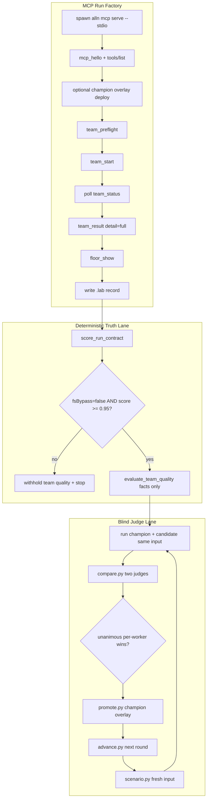

# Team Lab Slice 1 — Full Package

Status: **Active implementation spec** — authoritative execution packet for v1
Owner: Founder + CLI/MCP + Team Quality
Created: 2026-06-21
Updated: 2026-06-21
Depends on: [`Team_Lab_Run_Factory.md`](Team_Lab_Run_Factory.md),
[`CLI_Implementation_Contract.md`](CLI_Implementation_Contract.md),
[`CLI_Product_Spine.md`](CLI_Product_Spine.md),
[`Team_And_Skill_Catalogs.md`](Team_And_Skill_Catalogs.md)

Parent packet: [`Team_Lab_Run_Factory.md`](Team_Lab_Run_Factory.md) owns the
product thesis, vocabulary, and long-range slices. **This doc is the full Slice 1
execution contract** — everything required to go from "interesting harness" to a
repeatable, CLI-native calibration loop that can improve one default Team with
evidence.

## Purpose

Slice 1 is not the smallest high-leverage next step. It is the **whole v1 package**:

```text
MCP-only run factory
-> complete local lab record per case
-> deterministic run-contract truth gate
-> blind two-judge A/B on fresh inputs
-> per-worker champion banking
-> autopromote without founder gate
-> one Team (Bug Hunt) proven on known regressions
```

When Slice 1 is done, a developer can close the Mac app, run the factory headless,
trust the run-system verdict separately from Team quality, and improve Bug Hunt
prompts with a falsifiable loop — not anecdotes, not keyword scores, not GUI state.

## Slice Packet

| Field | Value |
| --- | --- |
| Slice | Team Lab Slice 1 (PRE-S0 + LAB-S00–S05 + Judge Loop v2) |
| Goal | One default Team earns its seat through MCP-only benchmark calibration |
| Primary specimen | `code_bug_hunt` on `bug_hunt_repo_regressions_v1` |
| Out of scope | Mac app, Core imports, heuristic quality scores, default-Team sweep, CI regression gates, `alln dev team-lab` Swift wrapper |
| Truth owner | MCP contract (`ContractRegistry`); run truth (`RunStore`/`TeamRunJSON`); lab records (`scripts/team_lab/`); champion overlays (`docs/team-lab/champions/`) |
| Lie-prone layer | Final packet quality masking worker failures; FS journal used as scoring oracle; mock judges treated as evidence; reusing inputs across rounds; promoting on one lucky run |

### Works Test

```text
Given the Mac app is closed
And `alln mcp serve --stdio` is reachable from the lab harness
When a developer runs one full calibration round on Bug Hunt
Then the factory creates a real run with a complete `.lab/<experiment-id>/` record
And run-contract scoring is green with fsBypass=false
And baseline and candidate ran on the exact same fresh input
And two live judges (different model families) produced a compare record
And promote.py either banks roles into the champion overlay or escalates with cause
And no TeamCatalog mutation happened without >= 3 clean live compare rounds
```

### Proof command (Slice 1 closeout)

```bash
# 1. Unit truth gates (no quota)
python3 scripts/team_lab/test_scoring.py
python3 scripts/team_lab/test_judge.py
python3 scripts/team_lab/test_promote.py

# 2. MCP smoke (no team run — hello + tools)
python3 scripts/team_lab/run.py --suite smoke_mcp_v1 --round 1

# 3. Substrate dogfood (Spec Review — contract only)
python3 scripts/team_lab/run.py --suite spec_review_mcp_lab_v1 --round 1 --variant baseline
python3 scripts/team_lab/evaluate.py .lab/<dir> --rescore-contract
# expect: fsBypass=false, runContractScore >= 0.95

# 4. Bug Hunt baseline immutability
python3 scripts/team_lab/run.py --suite bug_hunt_repo_regressions_v1 \
  --case composer_paste_dead_v1 --team code_bug_hunt --round 1 --variant baseline
# expect: runContractScore=1.0, judge-pending

# 5. Full calibration round (quota — live judges required for evidence)
export ALLN_JUDGE1_CMD='...'   # family A
export ALLN_JUDGE2_CMD='...'   # family B (must differ)
export ALLN_SCENARIO_CMD='...' # must NOT be either judge
python3 scripts/team_lab/advance.py \
  --suite bug_hunt_repo_regressions_v1 \
  --team code_bug_hunt \
  --round N \
  --champion-overlay docs/team-lab/champions/bug_hunt_repo_regressions_v1/code_bug_hunt.json
```

## End-to-End Architecture



### Two questions, never merged

```text
Did Allnighter's run system tell the truth?   -> run-contract lane (deterministic)
Did this Team produce excellent work?           -> blind judge lane (non-deterministic)
```

If the first answer is no, the second is **withheld**. Fix substrate before interpreting
any Team-quality conclusion.

## Current Reality (2026-06-21)

| Component | State |
| --- | --- |
| PRE-S0 pure-MCP scoring | **Built** — Spec Review R2–R5 at `fsBypass=false`, contract ≥ 0.95 |
| `scripts/team_lab/run.py` | **Built** — MCP stdio client, full run lifecycle, lab record, inline contract eval |
| `mcp_client.py` | **Built** — Content-Length JSON-RPC, transcript JSONL |
| `scoring.py` + `evaluate.py` | **Built** — run-contract checks, worker facts, writer consistency; no quality score |
| `compare.py` + `judge.py` | **Built** — blind per-worker + deliverable A/B; mock + live backends |
| `scenario.py` | **Built** — fresh-input generator + burn ledger |
| `promote.py` + `advance.py` + `overlay.py` | **Built** — champion overlay deploy, autopromote gate, round orchestrator |
| `test_scoring.py`, `test_judge.py`, `test_promote.py` | **Built** — truth-lane kill tests |
| Bug Hunt baseline R1 | **Built** — `composer_paste_dead_v1`, contract 1.0, strong packet, judge-pending |
| Champion overlay R4 | **In progress** — `docs/team-lab/champions/.../code_bug_hunt.json` with banked roles |
| Live two-judge path | **Unvalidated** — orchestration proven with `--mock`; live evidence not yet banked into `SkillCatalog` |
| Substrate bugs SUB-1–SUB-4 | **Open** — P2/P3; lab gates on detectable truth; completion ordering not MCP-verifiable |
| `alln dev team-lab` Swift wrapper | **Not built** — Python is canonical v1 |
| LAB-S06 default-Team sweep | **Deferred** |
| LAB-S07 regression gates in CI | **Deferred** |

## Sub-Slices (Full Detail)

### PRE-S0 — Pure-MCP Reconstruction Proof (blocking)

**Why it exists:** Early dogfood scored artifacts from copied run journals while
advertising MCP-only law. Any team-quality number from that era is invalid.

**Requirements:**

| Check | Meaning |
| --- | --- |
| `team_result(detail=full)` | Worker prompt snapshots, answer markdown, plan markdown retrievable |
| `floor_show({run})` | Returns the requested run, not latest-by-accident |
| Journal copy under `.lab/run/` | Diff-oracle only — **zero score weight** |
| `fsBypass=false` | Scoring used MCP payloads exclusively |
| `runContractScore >= 0.95` | All contract checks pass |

**Canonical retrieval pins:**

```text
Packet body           = team_result(detail=full).plan.markdown
Answer/review bodies  = team_result(detail=full).workerAnswers[].markdown
Worker prompts        = team_result(detail=full).workers[].resolvedWorkerPromptSnapshot
Terminal worker status = workerAnswers[].status (answer/review); plan.status (writer)
floor_show.summaryMarkdown is NOT the packet source (SUB-4)
```

**Status:** Satisfied for Spec Review R2–R5. Re-verify after any MCP mapper change.

---

### LAB-S00 — Lab Constitution and Fixtures

**Deliverables:**

- Phase docs: parent packet + this Slice 1 spec
- Suite JSON under `docs/team-lab/suites/`:
  - `smoke_mcp_v1` — hello/tools smoke
  - `spec_review_mcp_lab_v1` — substrate dogfood
  - `bug_hunt_repo_regressions_v1` — Bug Hunt known regressions (3 cases)
- Burn ledger: `docs/team-lab/used_inputs/<suite-id>.jsonl`
- Local storage: `REPO/.lab/<experiment-id>/` (gitignored)
- Redaction rules: no credentials/API keys in committed exports

**Suite case shape (minimum):**

```json
{
  "caseId": "composer_paste_dead_v1",
  "lane": "code",
  "teamId": "code_bug_hunt",
  "title": "...",
  "prompt": "...",
  "contextPolicy": {
    "repoRoot": "...",
    "contextFiles": ["docs/operations/debugger/DEBUGLOG.md"]
  },
  "expectedQualities": ["advisory for judges — never keyword-matched"],
  "scoringRubricId": "bug_hunt_v1"
}
```

**Status:** Built. Maintain suites as regression definitions evolve.

---

### LAB-S01 — MCP Transcript Harness

**Deliverables (`mcp_client.py`, `run.py` header path):**

1. Spawn `alln mcp serve --stdio` as child process
2. JSON-RPC `initialize` + `notifications/initialized`
3. `tools/list` — persist JSON + SHA-256 hash; fail if required tools absent
4. `mcp_hello` — persist readiness envelope
5. Append every request/response frame to `mcp-transcript.jsonl` with timestamps
6. Record: binary path, git head, support root, contract version, tools hash

**Required tools (minimum):**

`mcp_hello`, `team_preflight`, `team_start`, `team_status`, `team_result`,
`team_cancel`, `floor_show`

**Status:** Built.

---

### LAB-S02 — Run Factory Driver

**Deliverables (`run.py` run path):**

1. `team_preflight` — stop on `canStart=false`; classify `TEAM_GOVERNOR_UNAVAILABLE`
   vs real busy (see parent § Admission truth rule)
2. `team_start` — idempotency key `lab-{team}-r{round}-{uuid}`; persist response
3. `team_status` poll loop — respect `nextPollAfterMs`; record full history
4. Terminal honesty — `completed` / `failed` / `cancelled` / `interrupted`; deadline timeout
5. `team_result(detail=full)` — persist raw + parsed JSON
6. `floor_show(run=...)` — persist text + structured when available
7. Optional `team_cancel` on harness failure paths (manual today)

**CLI surface:**

```bash
python3 scripts/team_lab/run.py \
  --suite <suite-id> \
  [--case <case-id> | --case-json <path>] \
  [--team <team-id>] \
  [--round N] \
  [--variant baseline|candidate|...] \
  [--champion-overlay <path>] \
  [--effort high] \
  [--deadline-seconds 7200]
```

Prints `LAB_DIR=...` for downstream tools.

**Status:** Built.

---

### LAB-S03 — Artifact Collector

**Deliverables:**

Persist into `.lab/<experiment-id>/`:

```text
experiment.json
mcp-transcript.jsonl
initialize.json
tools-list.json
tools-list.sha256
mcp-hello.json
team-preflight.json
team-start.json
team-status-history.json
team-result.json
team-result-raw.txt
floor-show.json / floor-show.txt
run/                    # journal copy — diff-oracle ONLY
report.md
evaluation/             # created by scoring pass
```

**MCP-only law:** If a required artifact is missing from MCP payloads, emit P1
`fsBypass` or failed contract check — **do not** score team quality from disk.

**Status:** Built for current MCP surface. Stage inline markdown still limited by
SUB-2 (stage timestamps/markdown not projected over MCP).

---

### LAB-S04 — Evaluator and Report Model

**Deliverables (`scoring.py`, `evaluate.py`):**

**Deterministic — run contract (`evaluation/run-contract-score.json`):**

| Check | Fails when |
| --- | --- |
| `mcp_result_present` | `team_result` unparsable or empty |
| `mcp_worker_prompts` | Any worker missing prompt snapshot |
| `mcp_worker_answers` | Answer worker missing markdown |
| `mcp_writer_present` | Plan markdown empty |
| `mcp_worker_status` | Any non-plan worker lacks `workerAnswers[].status`; writer status absent |
| `mcp_fs_bypass` | Scoring fell back to journal copy |
| `terminal_status_honest` | Status/result mismatch |
| `floor_run_id` | `floor_show` returned wrong run (when case applies) |

Gate: `runContractScore >= 0.95` AND `fsBypass=false` → team quality may be judged.

**Deterministic — worker facts only (`evaluation/worker-facts.json`, `evaluator-record.json`):**

- Content present per worker
- Writer consistency vs `experiment.json` (stale round claims, etc.)
- **No quality score** — keyword/structure scoring was removed (Goodhart)

**Non-deterministic — compare records (produced by `compare.py`, not `evaluate.py`):**

- `evaluation/compare-record.json`
- `evaluation/compare.md`

**Status:** Built. Kill tests in `test_scoring.py`.

---

### LAB-S05 — Bug Hunt Calibration Loop

**Goal:** Take Bug Hunt from "strong anecdote" to "repeatable 9/10 on benchmark suite"
using the judge loop — not one-off prompt tasting.

**Benchmark suite (`bug_hunt_repo_regressions_v1`):**

| Case | Role |
| --- | --- |
| `composer_paste_dead_v1` | Real regression — paste dead after repeated fixes; baseline immutable |
| `mcp_fs_bypass_scoring_v1` | Meta — lab lied about MCP-only; proves contract gate |
| `floor_show_wrong_run_v1` | Meta — wrong-run retrieval regression; proves floor retrieval |

**Calibration experiments (one variable discipline per round):**

| Variant | Hypothesis |
| --- | --- |
| `baseline` | Current built-in Bug Hunt (GENESIS reference) |
| `evidence-packet` | Pre-collected git status/diff/logs in context |
| `reduced-lineup` | Reproducer, Truth Owner, Trace, Regression, Contrarian, Writer |
| `phase-split` | Planner/impact only after root-cause ranking |
| `model-routing` | Opus for Contrarian + Writer; faster locals for answer roles |
| `writer-contract` | Rank/reject/dissent/next-observation fields required |
| `candidate-rN` | Champion overlay + proposed prompt deltas for round N |

**Evidence packet contents (when enabled):**

- `git status --short`, branch, HEAD
- `git diff --stat` + relevant excerpts
- Recent commits on surface
- Matching `DEBUGLOG.md`, `BUG_PATTERNS.json`, regression law entries
- Relevant source snippets
- Blocked proof commands

**Prompt contract (all calibrated workers):**

```text
Evidence inspected:
Key claim:
Confidence:
What would falsify this:
What I reject and why:
Missing observation:
Output:
```

**Bug Hunt extra rule:**

```text
No high-confidence root cause unless current diff/log/prior attempts were
inspected or the worker explicitly says that evidence was unavailable.
```

**Writer rule:**

```text
Do not average. Decide. Preserve dissent. Prefer the mechanically checkable
minority over a confident majority when the evidence is stronger.
```

**Status:** Baseline R1 complete. Multi-round calibration with live judges in progress.
`SkillCatalog`/`TeamCatalog` mutations **blocked** until ≥ 3 clean live compare rounds.

---

### Judge Loop v2 (authoritative — part of Slice 1)

Quality is **judged**, never scored. The only deterministic lane is **truth**.

**Round protocol:**

```text
0. Substrate gate — both arms must be run-contract green (compare.py refuses otherwise)
1. scenario.py — FRESH input; append hash to burn ledger
2. run.py champion (overlay) + candidate (variant) on SAME --case-json
3. compare.py — two different-family judges, blind A/B per worker + deliverable audit
4. promote.py — bank unanimous per-worker wins; escalate on policy violations
5. advance.py — orchestrate full round; optional auto-promote
6. Burn input — next round never reuses it
```

**Roles and decision authority:**

| Thing | Decides? |
| --- | --- |
| Per-worker blind A/B (unanimous) | YES — bank candidate prompt for that role |
| Deliverable blind A/B | No — audit only; interaction warning, never veto |
| Idea-engine (un-blind hypotheses) | No — advisory |
| Run contract | Gate only |

**Bias controls:**

- Two **different model families** (`ALLN_JUDGE1_CMD`, `ALLN_JUDGE2_CMD`)
- **Isolated parallel** verdicts — no judge sees another's output first
- **Blind + order-seeded** — candidate side anonymized
- **Incumbent wins ties** — false-negative bias preferred over false-positive promotion
- **Generator independence** — `ALLN_SCENARIO_CMD` must not be either judge
- **`--mock`** — orchestration smoke only; `evidenceValid=false`; never promotes

**Champion overlay (`docs/team-lab/champions/<suite>/<team>.json`):**

- Banks proven role templates with provenance (round, source lab, hash)
- `overlay.py` deploys lab team via MCP before `team_start`
- Incumbent templates for non-banked roles

**Autopromote gate (`promote.py`):**

Promote when: `judgeMode=live`, `evidenceValid=true`, `sameInput=true`,
`interactionWarning=false`, no unmatched roles, `bankedRoles` non-empty,
`deliverableOutcome` favors candidate (or narrow tie).

Escalate (exit non-zero): mock judges, split deliverable with many banks, contract
not green, structural role mismatch, model failures, or high-risk surfaces
(privacy, credentials, billing, destructive git, distribution).

**SkillCatalog shipping:** After enough clean wins, `promote.py` writes reviewable
patches under `docs/team-lab/patches/` — only roles whose template differs from
built-in. Founder review is async; the loop does not wait.

**Status:** Harness built. Live judge validation and first `SkillCatalog` patch are
the remaining Slice 1 exit criteria.

---

## Experiment Record (complete schema)

```text
.lab/<experiment-id>/
  experiment.json           # run metadata + evaluation summary
  mcp-transcript.jsonl      # every JSON-RPC frame
  team-result.json          # MCP canonical payloads
  floor-show.json
  champion-overlay.json     # when used
  run/                      # journal copy — oracle only
  evaluation/
    run-contract-score.json
    worker-facts.json
    evaluator-record.json
    compare-record.json     # after compare.py
    compare.md
  report.md

.lab/promotions/            # promotion records from promote.py
docs/team-lab/champions/    # durable champion overlays (committed)
docs/team-lab/patches/      # reviewable SkillCatalog diffs (committed when ready)
docs/team-lab/reports/      # human summaries (committed selectively)
```

## MCP-Only Law (non-negotiable)

```text
spawn/connect: alln mcp serve --stdio
retrieve:      MCP tools only for scoring
forbidden:     Mac app, AllnighterCore import, RunStore direct read for scoring,
               hand-patched run files, GUI state as oracle
```

FS journal copy exists solely to **diff** MCP payloads against disk truth during
substrate debugging.

## Substrate Bug Stop List

Fix before interpreting team-quality numbers from affected runs. See parent doc §
Confirmed Substrate Bugs.

| ID | Impact on lab |
| --- | --- |
| SUB-1 | `completedAt` predates synthesis — ordering check unreliable |
| SUB-2 | Stage markdown/timestamps not in MCP — cannot verify stage completion |
| SUB-3 | `workerAnswers[].finishedAt` missing — ordering check incomplete |
| SUB-4 | `floor_show.summaryMarkdown` empty — documented; not packet source |

Lab already gates on detectable worker status (`mcp_worker_status`). SUB fixes
unlock richer contract checks, not basic usability.

## Slice 1 Execution Order

Execute in this order. Do not skip ahead to Team mutations before the gate exists.

```text
1. PRE-S0          Re-verify pure-MCP scoring after any MCP change
2. LAB-S00         Suites + ledger + doc routing (this file)
3. LAB-S01/S02     run.py smoke + team start on smoke_team suite
4. LAB-S03/S04     evaluate.py + test_scoring.py green
5. Bug Hunt baseline  composer_paste_dead_v1 immutable reference run
6. Meta cases      mcp_fs_bypass + floor_show_wrong_run as contract proofs
7. Mock round      advance.py --mock-judges — orchestration only
8. Live judges     Pin two families; run 3+ fresh-input rounds
9. Promote         Bank roles; write patches; do NOT merge to SkillCatalog until N≥3
10. Closeout       Committed report + champion overlay + proof commands green
```

## Done When (Slice 1)

- [ ] PRE-S0 green on current `alln` binary (re-run Spec Review or equivalent)
- [ ] `test_scoring.py`, `test_judge.py`, `test_promote.py` all pass
- [ ] Bug Hunt baseline R1 preserved; meta cases run at least once each
- [ ] At least **3 live judge compare rounds** on **fresh inputs** with `evidenceValid=true`
- [ ] Champion overlay reflects banked roles with provenance
- [ ] At least one `docs/team-lab/patches/` entry ready for SkillCatalog review
- [ ] No `TeamCatalog`/`SkillCatalog` built-in mutation merged without meeting N≥3 rule
- [ ] Substrate bugs SUB-1–SUB-4 filed; none block interpretation of current baseline
- [ ] Slice 1 closeout report under `docs/team-lab/reports/`

Explicitly **not** required for Slice 1 done: LAB-S06 sweep, LAB-S07 CI gates,
`alln dev team-lab` Swift wrapper, resident `alln serve` ownership.

---

## Good to Great (post–Slice 1)

Slice 1 makes the loop **real**. These slices make it **production-grade** and
**product-scaled**.

### Slice 2 — Substrate Hardening (P0/P1 truth)

**Goal:** MCP payloads are independently verifiable; lab stops filing the same SUB bugs.

| Work | Owner |
| --- | --- |
| SUB-1: `completedAt` after synthesis | `TeamRunJSONMapper.swift` |
| SUB-2: Project `stages[]` markdown + timestamps; honest `plan.status` | `TeamRunJSON` + mapper |
| SUB-3: Serialize `workerAnswers[].finishedAt` | Mapper |
| SUB-4: Populate or document `floor_show.summaryMarkdown` | `FloorProjector` |
| `run_artifact_get` MCP tool if `floor_show` insufficient | `ContractRegistry` + MCP |
| Admission: `TEAM_GOVERNOR_UNAVAILABLE` vs busy | `AsyncTeamService` + MCP errors |
| Readiness: lab-process runnable, not stale `SetupStore` cache | `doctor`/`team_preflight` |

**Proof:** Lab contract checks can verify completion ordering purely from MCP; meta
cases become regression fixtures in `test_scoring.py`.

---

### Slice 3 — Regression Gates (LAB-S07)

**Goal:** Cheap gates in normal CI; expensive suites nightly/manual.

```text
swift test --filter MCPAsyncTeamTests
python3 scripts/team_lab/run.py --suite smoke_mcp_mock_v1   # mock workers, no quota
MCP schema drift gate (tools/list hash vs generated descriptors)
Artifact completeness fixture gate
```

Add `scripts/check_team_lab.sh` wired into `scripts/check.sh` when mock suite is
stable. Quota-heavy Bug Hunt full runs stay manual or scheduled.

---

### Slice 4 — Product CLI Wrapper

**Goal:** `alln dev team-lab` as thin Swift wrapper over the Python harness.

```bash
alln dev team-lab suites --json
alln dev team-lab run --suite <id> --team <id> [--case <id>] --json
alln dev team-lab report <experiment-id> --json
alln dev team-lab compare <baseline> <candidate> --json
alln dev team-lab advance --suite <id> --team <id> --round N --json
```

Rule: wrapper spawns MCP stdio — **never** calls Core run APIs directly.

---

### Slice 5 — Default Team Sweep (LAB-S06)

**Goal:** Repeat Bug Hunt proof for Code planning, Design critique, Copy, Signal scout.

**Prerequisite:** Bug Hunt loop closed with `fsBypass=false` and ≥ 3 live wins.

Per Team:

1. Define suite from real job distribution (not toy prompts)
2. Run GENESIS baseline
3. 3+ fresh-input calibration rounds
4. Bank champions per suite/team
5. Patch `SkillCatalog` only after transfer guard passes

Do **not** sweep all Teams in parallel — sequential proof contains cost and learns
harness gaps early.

---

### Slice 6 — Verifiable Cases + Outcome Validity

**Goal:** Judges' taste tracks reality, not just artifact polish.

Add **verifiable cases** to each suite:

- Known bug with seeded repro steps
- Known kill-test that must appear in packet
- Structured eligibility fields (`FixPacket` / `BugPacket`) checked deterministically
  as **presence**, not quality score

Honest limit remains: judges evaluate artifacts. Verifiable cases anchor the anchor.

---

### Slice 7 — Evidence Packet Automation

**Goal:** Workers stop missing decisive facts because context was thin.

Factory-built evidence packet before `team_start`:

- MCP or repo-local collectors for git state, logs, patterns, prior attempts
- Injected into `context` field with labeled sections
- Workers must cite which evidence they used / what would falsify

Reduces "missed the current diff" failures without averaging away dissent.

---

### Slice 8 — Resident Coordinator Ownership

**Goal:** Overnight batches survive MCP stdio process death.

Route long factory batches through resident `alln serve` when it owns run lifecycle.
MCP stdio remains valid for manual single-case experiments.

See [`Mac_Standalone_App_And_Background_Coordinator.md`](Mac_Standalone_App_And_Background_Coordinator.md).

---

### Slice 9 — Operational Excellence

| Enhancement | Why |
| --- | --- |
| Batch reports across cases/rounds | See Team-level failure modes, not one run |
| Failure aggregation by source/model/skill | Routing and timeout truth |
| Debugger packet auto-generation on P0/P1 | Substrate bugs don't live in chat |
| Sanitized report export to `docs/team-lab/reports/` | Share evidence without secrets |
| Periodic GENESIS re-challenge | Catch slow champion drift |
| `Try Fix` integration | Bug Hunt `FixPacket` → execution Team under write lock |

---

### Slice 10 — Composition and Seat Economics (LAB-C00–C08)

**Goal:** Prove each seat earns **margin** (benefit − cost) on hard cases; calibrate
named team variants without assuming the nine-seat roster is correct.

**Spec:** [`Team_Lab_Composition_And_Seat_Economics.md`](Team_Lab_Composition_And_Seat_Economics.md)

**Prerequisite:** Bug Hunt micro loop closed (Slice 1); run-contract green on
calibration rounds.

Deliverables:

1. **LAB-C00** — macro verdict schema (`keep|add|remove|merge|escalate|hold`) + tests
2. Necessity suite (`bug_hunt_necessity_v1`): T2/T3, debugger/lab-failure provenance
3. Case tags: `tier`, `requiredCapabilities` (no worker filters on case truth)
4. Genesis baseline per case with **held context**; failures on file before REMOVE
5. **Forward selection** primary (`compose.py`); backward redundancy after stabilize
6. VNRC + cost ledger + writer disposition (`no_value` / `value_suppressed` / `noise_correctly_dropped`)
7. Asymmetric gates: ADD ≥3 fresh necessity inputs; REMOVE ≥5
8. Separate overlays: `code_bug_hunt_lite`, `code_bug_hunt`, `code_bug_hunt_forensics`
9. **H3** fix-level discipline as three-arm hypothesis (not pre-shipped seat)
10. Macro promotion in `promote.py` (`promotionClass: composition`)

Do **not** block Slice 5 Team sweep on LAB-C completion — but do not interpret
nine-seat prompt wins as proof every seat is necessary.

---

## Measurement Validity Rules (bind all slices)

- Run-contract green before any quality interpretation
- Fresh inputs between rounds; same input within a round for both arms
- No deterministic quality score — ever
- Mock judges never promote
- Built-in mutations require ≥ 3 clean live rounds
- Negative results recorded, not discarded
- Re-baseline against GENESIS periodically, not only last champion

## Open Questions (Slice 1)

| Question | Default for Slice 1 |
| --- | --- |
| Live judge model families? | Pin two different families; stamp versions in compare record |
| Minimum benchmark count before SkillCatalog merge? | ≥ 3 clean live rounds on fresh inputs |
| Lab records in Application Support vs `.lab/`? | `.lab/` for v1; export sanitized reports to `docs/team-lab/reports/` |
| `floor_show` vs `run_artifact_get`? | `team_result(detail=full)` is canonical; add MCP tool only if gap proven |
| Long runs via `alln serve`? | Optional post–Slice 1; stdio sufficient for v1 manual runs |

## Routing

| Task | Read |
| --- | --- |
| Product thesis, inference bans, rubric guidance | [`Team_Lab_Run_Factory.md`](Team_Lab_Run_Factory.md) |
| Execute Slice 1 | **This doc** |
| CLI contracts / envelopes | [`CLI_Implementation_Contract.md`](CLI_Implementation_Contract.md) |
| Team/skill source truth | [`Team_And_Skill_Catalogs.md`](Team_And_Skill_Catalogs.md) |
| Bug Hunt → Try Fix chain | [`Try_Fix_Auto_Implement.md`](Try_Fix_Auto_Implement.md) |
